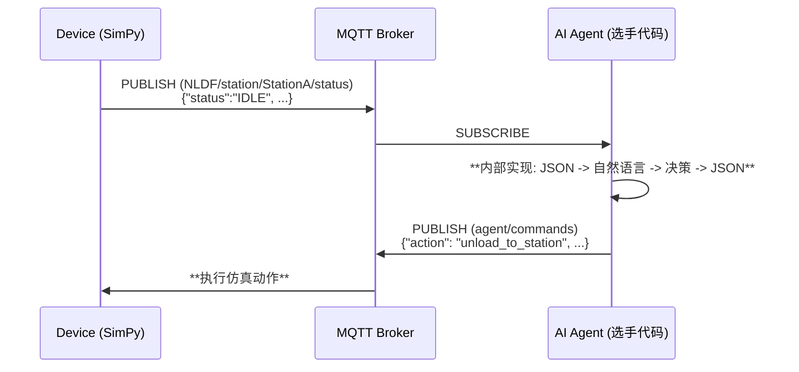

# SUPCON NLDF (Natural Language Driven Factory) Simulator

## Architecture Overview

This project implements a modular factory automation system with separated concerns:

- **MQTT Listener Manager** (`src/mqtt_listener_manager.py`): Handles all MQTT subscriptions and maintains factory state
- **Line Commander** (`src/line_commander.py`): Central decision-making component that coordinates AGV operations
- **Product Flow Agent** (`src/product_flow_agent.py`): Specialized AI agent that understands complete product workflow
- **Order MQTT Handler** (`src/order_mqtt_handler.py`): Processes order-related messages
- **Main Entry Point** (`main_line_commander.py`): Runs the new modular system

## Quick Start

### 1. Environment Setup

- Download [uv](https://docs.astral.sh/uv/getting-started/installation/)

```bash
curl -LsSf https://astral.sh/uv/install.sh | sh
```

- Clone project

```bash
git clone https://github.com/supcon-international/25-AdventureX-SUPCON-Hackathon.git
cd 25-AdventureX-SUPCON-Hackathon
```

- Install dependencies

```bash
uv sync
```

### 2. Run Simulation

设置环境变量`TOPIC_ROOT`作为仿真系统 mqtt 的 client id 和 topic root 来分隔不同选手，默认值获取顺序为`TOPIC_ROOT`, `USERNAME`, `USER`的环境变量，否则默认"NLDF_TEST"

- add `--menu` arg to enable interactive input thread for test only
- add `--no-mqtt` arg to disable mqtt communication for debug offline

```bash
uv run run_multi_line_simulation.py (--menu) (--no-mqtt)
```

### 3. Run New Modular Agent System

#### Multi-Line Factory System (Recommended)

Run all 3 production lines simultaneously with intelligent coordination:

```bash
# Set your OpenAI API key
export OPENAI_API_KEY='your-api-key-here'

# Optional: Configure system parameters
export MAX_ORDERS_PER_CYCLE='2'
export TOPIC_ROOT='your-topic-root'

# Run the complete multi-line factory system
uv run main.py
```

#### Single Line System

Run a single production line for testing or development:

```bash
# Set your OpenAI API key
export OPENAI_API_KEY='your-api-key-here'

# Optional: Set line ID and max orders per cycle
export LINE_ID='line1'
export MAX_ORDERS_PER_CYCLE='2'

# Run single line commander system
uv run main_line_commander.py
```

#### Monitoring Dashboard

Monitor all production lines in real-time:

```bash
# Run the monitoring dashboard (in a separate terminal)
uv run monitor_dashboard.py
```

````

### 4. Unity Run

1. 设置 `StreamingAssets/MQTTBroker.json`中的 Root_Topic_Head 字段与上述的 topic root 一致，并修改 wss.client_id 字段防止 client 冲突。
2. 使用 VScode Live Server 插件，选中到 index.html 文件后 go live 初始化给予 WebGL 的 Unity 前端界面

   "wss":{
   "port": 8084,
   "host": "ec2-13-212-179-9.ap-southeast-1.compute.amazonaws.com",
   "client*id": "\*\*\_NLDF2_mqtt_wss_test*\*\*",
   ......
   },

   "common*topic":{
   "Root_Topic_Head": "\*\*\_NLDF1*\*\*"},

## Multi-Line Factory System

### Complete Factory Automation

The new system manages all 3 production lines simultaneously:

- **Line 1**: AGV_1 & AGV_2 with specialized P3 processing
- **Line 2**: AGV_1 & AGV_2 with specialized P3 processing
- **Line 3**: AGV_1 & AGV_2 with specialized P3 processing
- **Total**: 6 AGVs coordinated by 3 Line Commanders
- **Monitoring**: Real-time dashboard for all lines

### Key Features

- **Concurrent Operations**: All 3 lines operate simultaneously
- **Independent Decision Making**: Each line has its own Line Commander
- **Shared Resources**: Common warehouse and order management
- **Real-time Monitoring**: Live dashboard showing all line statuses
- **Graceful Shutdown**: Proper cleanup of all resources
- **Error Recovery**: Individual line failure doesn't affect others

## System Improvements

### New Modular Architecture Benefits

1. **Separated Concerns**:

   - MQTT communication is isolated in `MQTTListenerManager`
   - Decision-making logic is centralized in `LineCommander`
   - Order processing is handled by dedicated `OrderMQTTHandler`

2. **Better Responsiveness**:

   - Reactive event processing for critical factory events (battery low, blockages, alerts)
   - Planned operation cycles for regular order processing
   - Prioritized decision queue based on event severity

3. **Improved Maintainability**:

   - Clear separation between MQTT handling and AI decision-making
   - Modular components that can be tested and modified independently
   - Better error handling and logging

4. **Enhanced Decision Making**:

   - Context-aware AI agent with factory state awareness
   - Both planned and reactive decision modes
   - Command history and session management for learning
   - Specialized Product Flow Agent that understands complete workflow

5. **Product Flow Intelligence**:
   - Understands successful product flow patterns (P1/P2 vs P3 workflows)
   - Optimizes AGV operations based on actual factory workflow
   - Prioritizes critical tasks: RawMaterial pickup and QualityCheck delivery
   - Handles P3 double processing automatically

### Key Features

- **Dual Processing Modes**: Planned operations (every 8 seconds) and reactive processing (within 2 seconds for critical events)
- **Event Prioritization**: Critical, High, Medium, Low severity levels for different factory events
- **State Management**: Centralized factory state maintained by MQTT listener
- **Command Tracking**: Full command history with responses and execution tracking
- **Product Flow Intelligence**: Specialized agent that understands complete product workflows

### Successful Product Flow (Based on Real Factory Data)

#### P1/P2 Products (Single Processing):

1. **AGV → P0 (RawMaterial)** → load specific product_id
2. **AGV → P1 (StationA)** → unload (automatic processing starts)
3. **[AUTOMATIC]** StationA → Conveyor_AB → StationB → Conveyor_BC → StationC → Conveyor_CQ → QualityCheck
4. **AGV → P8 (QualityCheck)** → load finished product
5. **AGV → P9 (Warehouse)** → unload finished product

#### P3 Products (Double Processing):

1. **AGV → P0 (RawMaterial)** → load specific product_id (e.g., 'prod_3_75a16c3d')
2. **AGV → P1 (StationA)** → unload
3. **[AUTOMATIC]** StationA → Conveyor_AB → StationB → Conveyor_BC → StationC → Conveyor_CQ (**upper_buffer**)
4. **🚨 CRITICAL: Only AGV_2 → P6 (Conveyor_CQ)** → load same product_id from **upper_buffer**
5. **AGV_2 → P3 (StationB)** → unload (second processing cycle)
6. **[AUTOMATIC]** StationB → Conveyor_BC → StationC → Conveyor_CQ → QualityCheck
7. **AGV → P8 (QualityCheck)** → load same product_id (finished product)
8. **AGV → P9 (Warehouse)** → unload finished product

#### 🚨 Critical AGV Buffer Access Restrictions:

- **AGV_1 at P6**: Can only access Conveyor_CQ `lower_buffer`
- **AGV_2 at P6**: Can only access Conveyor_CQ `upper_buffer`
- **P3 products after first processing**: Go to `upper_buffer`
- **Therefore**: **ONLY AGV_2 can handle P3 second processing!**

#### Exact P3 Command Sequence (Based on Real Factory Data):

```json
[
  // Stage 1: RawMaterial → StationA (Any AGV can do this)
  { "action": "move", "target": "AGV_1", "params": { "target_point": "P0" } },
  {
    "action": "load",
    "target": "AGV_1",
    "params": { "product_id": "prod_3_75a16c3d" }
  },
  { "action": "move", "target": "AGV_1", "params": { "target_point": "P1" } },
  { "action": "unload", "target": "AGV_1", "params": {} },

  // Stage 2: Conveyor_CQ upper_buffer → StationB (ONLY AGV_2!)
  { "action": "move", "target": "AGV_2", "params": { "target_point": "P6" } },
  {
    "action": "load",
    "target": "AGV_2",
    "params": { "product_id": "prod_3_75a16c3d" }
  },
  { "action": "move", "target": "AGV_2", "params": { "target_point": "P3" } },
  { "action": "unload", "target": "AGV_1", "params": {} },
  { "action": "move", "target": "AGV_1", "params": { "target_point": "P8" } },
  {
    "action": "load",
    "target": "AGV_1",
    "params": { "product_id": "prod_3_75a16c3d" }
  },
  { "action": "move", "target": "AGV_1", "params": { "target_point": "P9" } },
  { "action": "unload", "target": "AGV_1", "params": {} }
]
````

#### Key Insights:

- **AGV is only needed for**: RawMaterial→StationA, QualityCheck→Warehouse, (P3: Conveyor_CQ→StationB)
- **Stations and conveyors** handle processing automatically (5 seconds each)
- **Monitor RawMaterial buffer** for new products to start production
- **Monitor QualityCheck output_buffer** for finished products to deliver
- **P3 Critical**: Monitor Conveyor_CQ upper_buffer/lower_buffer for P3 products needing second processing

#### P3 Product Detection:

- **Raw Materials**: Products with 'prod_3' in product_id (e.g., 'prod_3_75a16c3d')
- **Second Processing**: P3 products in Conveyor_CQ upper_buffer or lower_buffer
- **Finished Products**: P3 products in QualityCheck output_buffer after double processing

## Background

Agent 成了每个领域绕不开的革命火种，在工业领域亦是如此。作为国内工业自动化的龙头企业，我们正在积极尝试将最前沿的 agent 技术引入真实产线，推动传统工厂向自适应、自组织、自优化系统演进。
我们进一步畅想：能否构建一个像人类一样通过语言决策的智能体系统？可以想象机器之间对话：“我这边快满了，暂停投料。”
“收到，我先缓一轮。”用语言做到理解彼此、协作应变、自主决策，实现工厂收益最大化的同时稳定运行。为此，我们搭建了一个可控的模拟工厂，等待你来赋予它思维与行动，探索 agent 与工业协作的新可能。

## 场景解释

工厂内部包含 3 条产线，一个原料仓库以及一个最终产品仓库，3 条产线配置有一样的 A，B，C 工站以及一个质检站，AB，BC，CQ 三条中间连接的自动传送带和 AGV_1，AGV_2 两个 AGV。选手需要对 3 条产线的一共 6 个 AGV 进行操作（包括移动，装货卸货等），选手需要在有限的时间内操作 agv 协调生产，同时应对随机故障，获得尽可能高的 KPI 得分。（KPI 定义见下文）

为了简单起见，每个 AGV 的可移动路径点都使用 P1-P10 来表示，他们表示当前 AGV 路径上的相对可停顿点，如果希望 AGV1 或 2 前往某点例如原料仓库，都需要移动到 P0 点。AGV 路径互不干扰，不考虑碰撞等因素，路径上的点 ID 如图。


| point_id | device_id    | 备注      |
| :------- | :----------- | :-------- |
| P0       | RawMaterial  | 原料仓库  |
| P1       | StationA     | 工站 A    |
| P2       | Conveyor_AB  | 传送带 AB |
| P3       | StationB     | 工站 B    |
| P4       | Conveyor_BC  | 传送带 BC |
| P5       | StationC     | 工站 C    |
| P6       | Conveyor_CQ  | 传送带 CQ |
| P7       | QualityCheck | 质检站    |
| P8       | QualityCheck | 质检站    |
| P9       | Warehouse    | 成品仓库  |

## 游戏机制

游戏使用 simpy 实现离散工厂的仿真

1. Order Generactor: 游戏有一个全局的订单生成器，每个订单中可能有一个或多个产品等待加工，一旦生成对应待加工的 product 会在原料仓库中出现
2. 产品说明： 游戏定义 P1，P2，P3 三种产品，产品 id:prod_1_XXXXXX 中包含 3 部分 prod,type 数字和 UUID，产品有自己对应的工艺流程：

- 产品 P1 / P2

```
RawMaterial → [AGV] → StationA → Conveyor_AB → StationB → Conveyor_BC → StationC → Conveyor_CQ → QualityCheck → [AGV] → Warehouse
```

- 产品 P3

```
RawMaterial → [AGV] → StationA → Conveyor_AB → StationB → Conveyor_BC → StationC → Conveyor_CQ[upper/lower buffer] → [AGV] → StationB → Conveyor_BC → StationC → Conveyor_CQ → QualityCheck → [AGV] → Warehousse
```

3. AGV 动作操控时会消耗电量，在移动前检查如果当前电量不足以完成动作，AGV 会自动返回充电站充电。
4. KPI 指标

| 类别         | 指标         | 计算公式                                      |
| :----------- | :----------- | :-------------------------------------------- |
| **生产效率** | 订单完成率   | `按时完成订单数 / 总订单数 × 100%`            |
|              | 生产周期效率 | `实际生产时间 / 理论生产时间`（含完成率权重） |
|              | 设备利用率   | `设备工作时间 / 总时间 × 100%`                |
| **质量成本** | 一次通过率   | `一次通过质检数 / 总产品数 × 100%`            |
|              | 生产成本     | `Σ(物料+能源+维修+报废成本)`                  |
| **AGV 效率** | 充电策略     | `主动充电次数 / 总充电次数 × 100%`            |
|              | 能源效率     | `完成任务数 / 总充电时间`                     |
|              | AGV 利用率   | `运输时间 / (总时间-故障-充电) × 100%`        |

5. 竞赛评分系统（100 分制）

- **生产效率**（40 分）：订单完成率 16 分 + 周期效率 16 分 + 设备利用率 8 分
- **质量成本**（30 分）：一次通过率 12 分 + 成本控制 18 分
- **AGV 效率**（30 分）：充电策略 9 分 + 能效比 12 分 + 利用率 9 分

## 3. 功能与架构

### 3.1 核心工作流：外部 JSON 接口，内部自然语言驱动

仿真环境与选手 Agent 之间通过结构化的 JSON 消息进行通信，我们要求选手在自己的 Agent 内部构建自然语言处理能力，形成 `JSON -> NL -> JSON` 的完整决策链路。



### 3.2 MQTT 通信层

#### Topic 架构 (`NLDF_DEFAULT` will be replaced by use environment variable `TOPIC_ROOT`)

| Topic                                         | Agent 权限    | 描述                            | 消息格式 (Payload) |
| :-------------------------------------------- | :------------ | :------------------------------ | :----------------- |
| `NLDF_DEFAULT/{line_id}/station/{id}/status`  | **Subscribe** | 订阅所有工站的状态              | JSON (结构化)      |
| `NLDF_DEFAULT/{line_id}/agv/{id}/status`      | **Subscribe** | 订阅所有 AGV 的状态             | JSON (结构化)      |
| `NLDF_DEFAULT/{line_id}/conveyor/{id}/status` | **Subscribe** | 订阅所有传送带的状态            | JSON (结构化)      |
| `NLDF_DEFAULT/warehouse/{id}/status`          | **Subscribe** | 订阅所有仓库的状态              | JSON (结构化)      |
| :---                                          | :---          | :---                            | :---               |
| `NLDF_DEFAULT/{line_id}/alerts`               | **Subscribe** | 订阅所有设备故障警报            | JSON (结构化)      |
| `NLDF_DEFAULT/orders/status`                  | **Subscribe** | 接收新订单信息                  | JSON (结构化)      |
| `NLDF_DEFAULT/kpi/status`                     | **Subscribe** | 订阅 KPI 更新                   | JSON (结构化)      |
| `NLDF_DEFAULT/result/status`                  | **Subscribe** | 订阅结果更新                    | JSON (结构化)      |
| :---                                          | :---          | :---                            | :---               |
| `NLDF_DEFAULT/command/{line_id}`              | **Publish**   | 发布选手 Agent 生成的结构化指令 | JSON (结构见下文)  |
| `NLDF_DEFAULT/response/{line_id}`             | **Subscribe** | 接收选手 Agent 的响应           | JSON（结构见下文） |

选手发往 `NLDF_DEFAULT/command/{line_id}` 的消息**必须**是以下格式的 JSON 字符串：

```json
{
  "command_id": "str (可选字段，用于记录决策过程)",
  "action": "str (必须是支持的动作之一)",
  "target": "str (动作的目标设备ID，可选)",
  "params": {
    "key1": "value1", ...
  }
}
```

系统反馈 `response/{line_id}` 的消息如下：

```json
{
  "timestamp": "float (仿真时间戳)",
  "command_id": "str (来自于选手的command_id)",
  "response": "str (反馈信息)"
}
```

支持的指令 `action` 和所需 `params`，command_id is optional, can be ignored.

| Action       | 描述                                                                               | Target | 示例                                                                                                                                                                                |
| :----------- | :--------------------------------------------------------------------------------- | :----- | :---------------------------------------------------------------------------------------------------------------------------------------------------------------------------------- |
| `move`       | 命令 AGV 移动到指定路径点                                                          | AGV ID | `{'command_id': 'move_688777', 'action': 'move', 'target': 'AGV_1', 'params': {'target_point': 'P1'}}`                                                                              |
| `charge`     | 命令 AGV 主动充电                                                                  | AGV ID | `{'command_id': 'charge_688777', 'action': 'charge', 'target': 'AGV_1', 'params': {'target_level': 70.0}}`(default: 80.0)                                                           |
| `unload`     | 命令 AGV 卸载产品到指定工站                                                        | AGV ID | `{'command_id': 'unload_688777', 'action': 'unload', 'target': 'AGV_2', 'params': {}}`                                                                                              |
| `load`       | 命令 AGV 从指定工站装载产品                                                        | AGV ID | `{'command_id': 'load_688777', 'action': 'load', 'target': 'AGV_1', 'params': {'product_id': 'prod_1_1ee7ce46'}}`(Product ID only can be used in RawMaterial, else will be ignored) |
| 全局 action  | topic 中的 line_id 和 payload 中的 target 字段内容可以忽略，仅为过 schema 格式审核 | 全局   | :---                                                                                                                                                                                |
| `get_result` | 获取当前整个工厂的 KPI 结果                                                        | any    | `{'command_id': 'get_result_688777', 'action': 'get_result', 'target': my factoty', 'params': {}}`                                                                                  |

## 4.评价维度

除了 ADVX 的统一评价维度外，我们将从以下四个方面对你的项目进行等权重评价：

1. **KPI 得分**

   - 这是最直接且客观的评价标准。我们将根据你搭建的 Agent 在预定义 KPI 指标上的表现进行评分。
   - _注意：如果你对虚拟工厂进行了修改，我们会综合考虑这些改动对 KPI 得分的影响。_

2. **LLM Agent 工程能力**

   - 你需要设计或使用一个框架，使 LLM 能够通过 MQTT + JSON 与虚拟工厂高效交互。
   - 我们将重点考察你在上下文管理、状态管理、错误处理等关键机制上的实现。
   - 优雅、健壮的 Agent 工程设计将获得额外加分。

3. **虚拟工厂的改进**

   - 虚拟工厂基于 Simpy 实现，模拟了真实世界的高级排程（Advanced Scheduling）问题。
   - 如果你发现工厂存在不合理之处，可以直接修改或扩展其运行机制，使其更贴近真实工厂。
   - _如对虚拟工厂有任何修改，请务必在项目 README 中显著注明。_

4. **supOS-CE 开源框架的应用**

   - 成功部署 supOS-CE，并使用其自带的 MQTT Broker 作为虚拟工厂与 Agent 的通信接口，将获得加分。
   - 如果你进一步集成了 supOS-CE 的其他组件（如 NodeRED、Portainer 等），或发现并反馈了其问题/bug，也会获得额外加分。

   - > [supos 选手使用方法](https://ofra65wfwe.feishu.cn/wiki/SRgrwj9LWimsTikRFdzcVvlDnEU)

---
